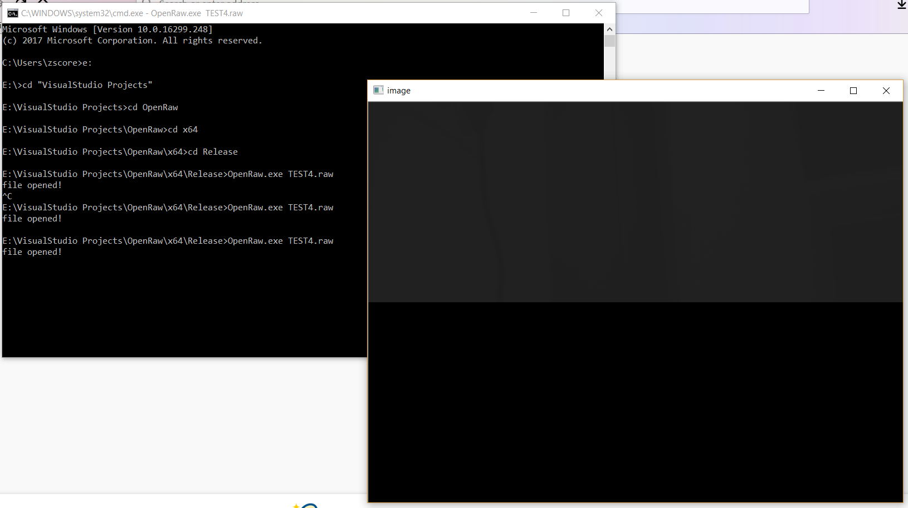

# OpenRaw

A command-line viewer for RAW files. Visual Studio Solution file also included.

# Usage

`OpenRaw.exe filename.raw`

# Screenshot

 

# Dependencies

OpenCV3

# License

GNU GPL v3

# Troubleshooting

In case you see an error about `fopen()` and `fread()` being deprecated. You can supress specific errors this way. In Visual Studio 2017, navigate to

```
Project Properties → Configuration Properties → C/C++ → Advanced
```

In `Disable Specific Warnings` write `4996`. Click OK and rebuild the solution.
